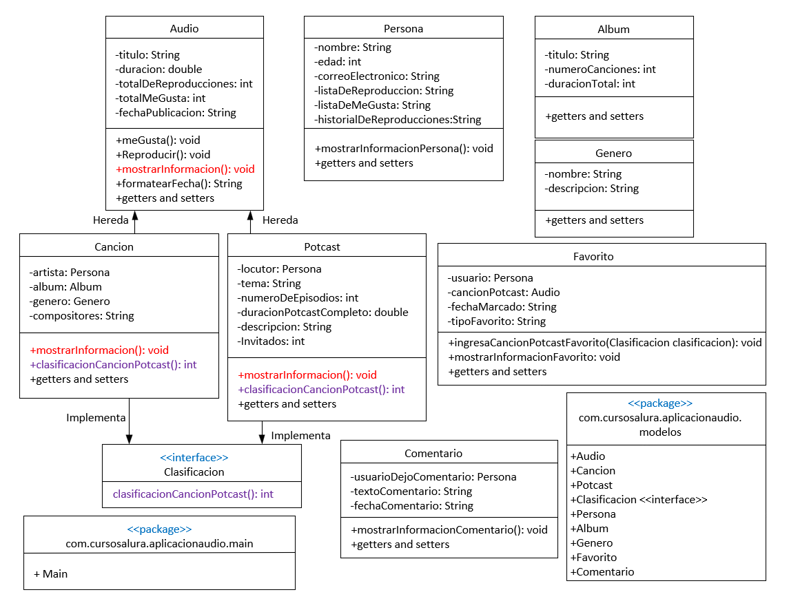
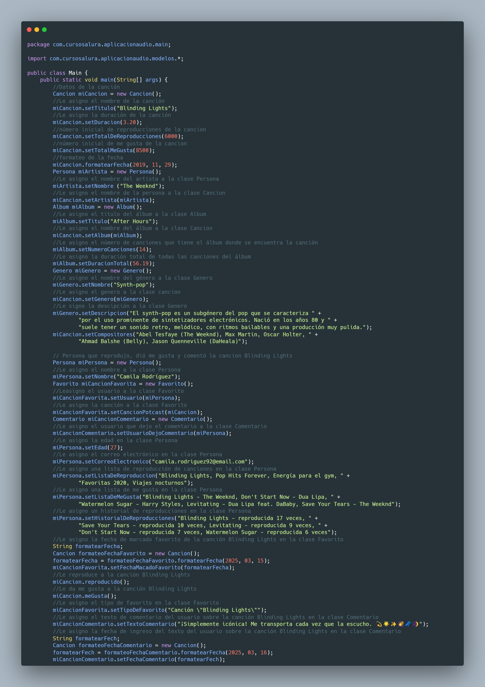
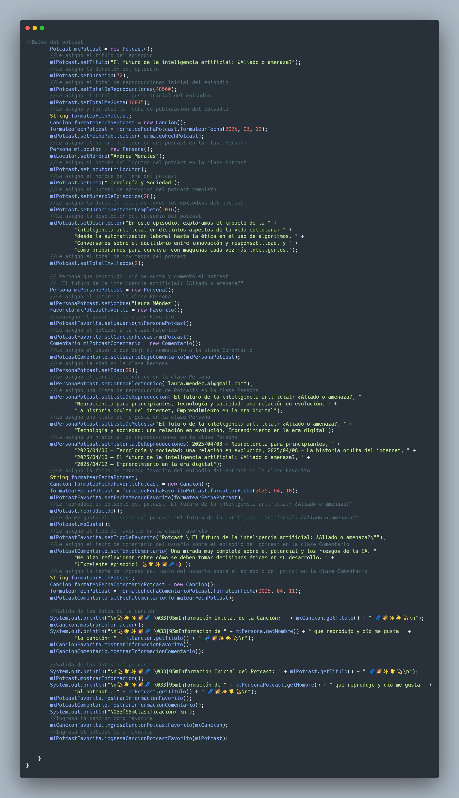
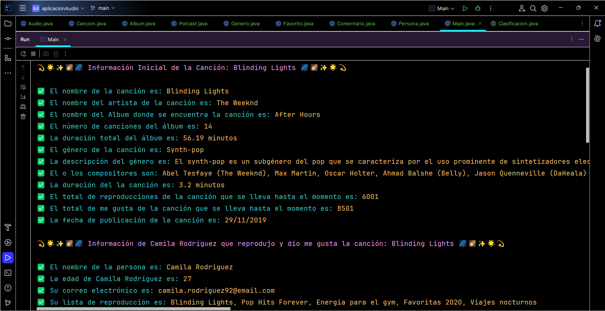
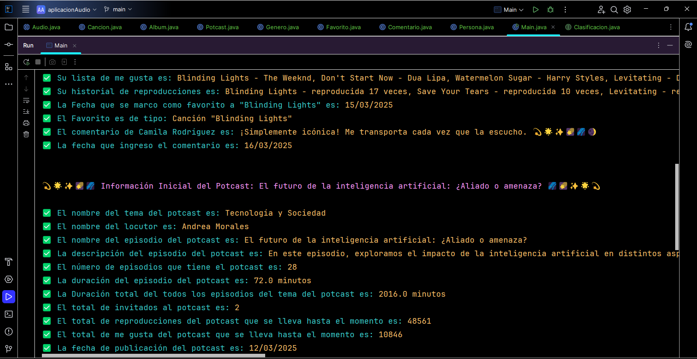
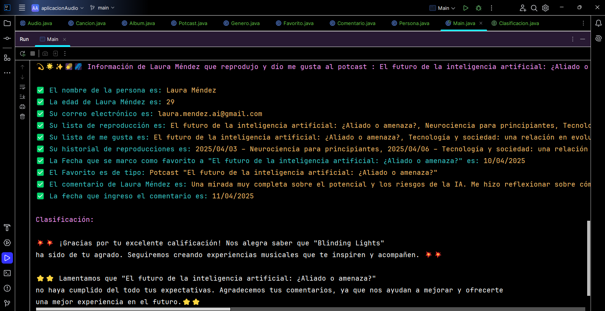
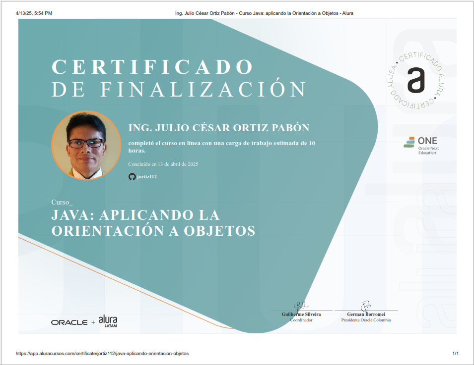

***
# <h1 align="center"> 💥Challenge Conversor de Monedas consumiendo ExchangeRate-API💥 </h1>
***



## 📄Descripción del proyecto

```sh

Aplicación Audio es una aplicación orientada a objetos desarrollada en Java que permite gestionar y 
reproducir contenidos de audio, como canciones y podcasts. El sistema modela entidades como personas 
(artistas o locutores), episodios, géneros y metadatos, aplicando los principios fundamentales de la 
programación orientada a objetos: abstracción, encapsulamiento, herencia y polimorfismo.
El sistema maneja dos tipos principales de contenido:
    - Canciones, que incluyen título, artista, álbum, género, duración.
    - Podcasts, que tienen un locutor, una lista de episodios, duración total, género, etc.

```

## 📃Objetivos de aprendizaje

```sh

- Diseñar una aplicación modular basada en clases para representar distintos tipos de contenido de 
  audio.
- Implementar una arquitectura reutilizable y extensible.
- Aplicar los principios de la POO para mejorar el mantenimiento y la escalabilidad del sistema.
- Simular la reproducción de canciones y podcasts, mostrando sus datos y comportamiento.
- Permitir registrar y mostrar la información relevante de los contenidos.

```

## 🛠️Recursos y herramientas utilizados

```sh

- Trello: para organizar las tareas y el progreso del proyecto.
- Discord: para comunicarse con los compañeros y aclarar dudas.
- Cursos y formaciones de Alura Latam: para consultar contenidos relevantes y obtener más información.
- GitHub: para publicar y compartir el código del proyecto.
- LinkedIn: para conectarse con la comunidad y mostrar el aprendizaje adquirido.

```

## 📗Funcionalidad del Conversor de Monedas

```sh

1. Crear y mostrar información de una canción (título, duración, artista, álbum, género).

2. Crear y mostrar un podcast (título, duración total, locutor, género, lista de episodios).

3. Representar personas (artistas y locutores) como objetos reutilizables.

4. Mostrar información detallada:
    - Título, duración, género, artista o locutor, álbum (si aplica), número de episodios 
      y más.

5. Gestionar múltiples episodios en un podcast:
    - Visualizar nombre y duración de cada episodio.

6. Soporte para diferentes tipos de contenido usando polimorfismo:
    - Métodos genéricos como reproducir() y mostrarInfo() implementados de forma distinta en 
      canciones y podcasts.

```
## 📑Características

- ✅ Diseño limpio, basado en clases con responsabilidad única.

- ✅ Manejo de listas de episodios en podcasts con estructuras de datos (List<Episodio>).

- ✅ Código reutilizable y extensible (por ejemplo, se podrían agregar más tipos de contenido 
     audiolibros).

- ✅ Clases bien separadas: Persona, Canción, Podcast, Episodio, etc.

## 🧱Tecnologías Utilizadas

✔️☕ Oracle Java OpenJDK 21.0.6

✔️🛠️ IntelliJ IDEA 2025 1.1.1

✔️✅ Estructura de carpetas orientada a paquetes lógicos: modelos, main.

## 🧭Arquitectura y diseño

- Capa de Modelo (Clases de Dominio):
    - ContenidoAudio (abstracta): Clase base para Cancion y Podcast.
    - Persona: Representa artistas o locutores.
    - Episodio: Representa un episodio dentro de un podcast.

- Capa de Control (Lógica de aplicación):
    - Métodos como reproducir() y mostrarInfo() en las clases derivadas.

- Capa de Presentación (interfaz de usuario por consola):
    - Clase Main: Simula una prueba de funcionamiento del sistema.

## 🙏Contribuciones

>> Si deseas contribuir al proyecto, siéntete libre de hacer un fork del repositorio y enviar un 
   pull request con tus mejoras o sugerencias.

## 🔆Resultados del Conversor de Monedas

>> 

>> 

>> 

>> 

>> 

## 👩👨Autores del Proyecto

>>     Programación Java POO, diagrama UML
>                               
>>>   Desafio puesto

## 📜Certificado

